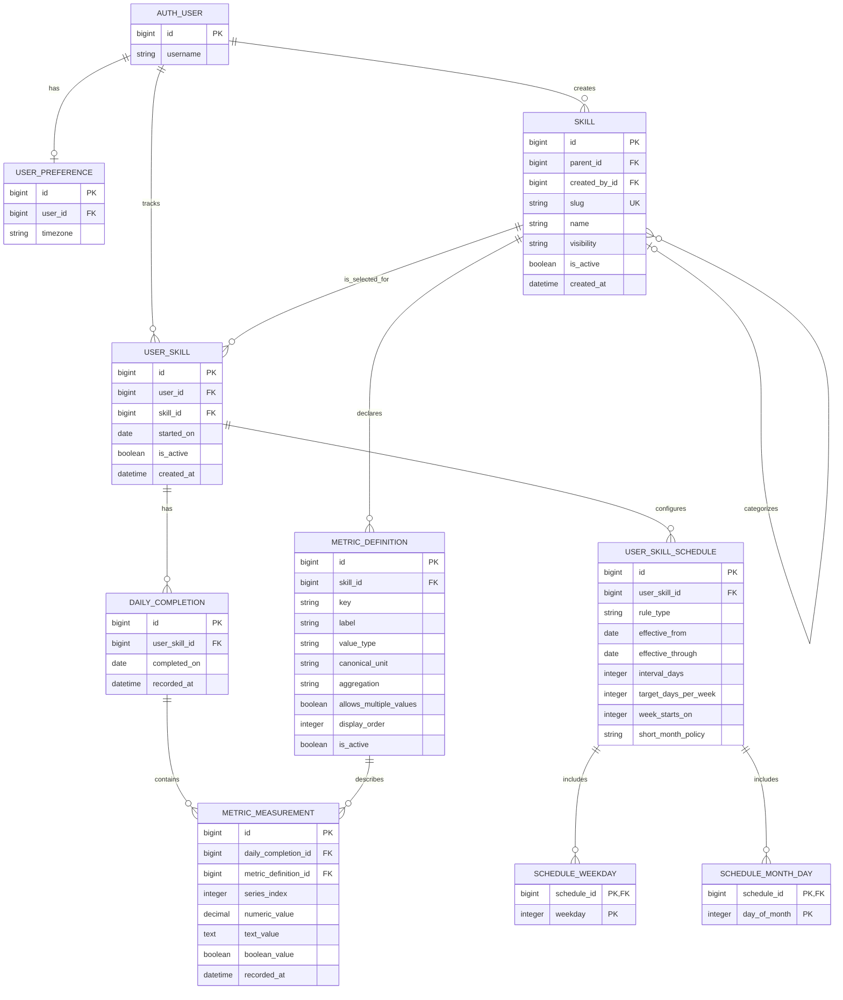

# Proposed SkillStreak Schema ERD

**Status:** Draft — design input for the first Django application specification;
this document does not create models or migrations.

## Purpose

Support the current daily yes/no habit tracker while allowing a future skill to
declare its own sub-metrics without a database migration. A skill may have no
metrics at all, one daily metric, or several repeated measurements.

## Entities and rules

### `AUTH_USER`

The Django-configured user model. Django models must refer to it through
`settings.AUTH_USER_MODEL`, never by a hard-coded table name. The entity is
shown here only to make ownership clear.

### `USER_PREFERENCE`

One optional row per account. Its IANA timezone (for example,
`America/Los_Angeles`) defines which local date a completion belongs to. This
is account configuration, not a progress metric.

### `SKILL`

The reusable definition of a trackable activity. The initial system skills are
Exercise, Eat Healthy, Read, Learn, Touch Grass, Go to Gym, Hobby, Drink
Water, and Sleep. New system or public skills are rows, not model or migration
changes. `initial_data.sql` seeds only those nine system skills.

- `parent_id` is optional and supports organizing a narrower skill beneath a
  broader category; tracking a child does not automatically complete its
  parent.
- `created_by_id` is null for platform-provided skills and identifies the
  creator of a future custom skill.
- `visibility` is one of `SYSTEM`, `PUBLIC`, or `PRIVATE`. Only shared skills
  should be eligible for a shared leaderboard.
- `is_active` archives a definition without destroying historical activity.

### `METRIC_DEFINITION`

A configurable field belonging to a skill. It determines what can be recorded,
how it is stored, and how a future leaderboard or summary may aggregate it.

- `key` is a stable machine identifier such as `minutes`, `pages`, or
  `distance`.
- `value_type` is `NUMBER`, `TEXT`, or `BOOLEAN`.
- Numeric values are stored in the declared `canonical_unit` (`kg`, `minutes`,
  `milliliters`, and so on); any display-unit conversion belongs in Django.
- `aggregation` is `LATEST`, `SUM`, `MAX`, `MIN`, or `AVERAGE`.
- `allows_multiple_values` enables repeated readings within one completion.

### `USER_SKILL`

Represents one account adding one skill to its own tracker. This is the
authorization boundary for completion and metric-entry actions.

### `DAILY_COMPLETION`

Represents the sole MVP progress signal: the user did the skill on a local
calendar day. The row itself means true; there is deliberately no `did_it`
boolean or quantity column.

### `USER_SKILL_SCHEDULE`

A versioned expectation rule belonging to a user's tracked skill. A schedule
answers *when a completion is expected*, while `DAILY_COMPLETION` records what
the user actually did. This separation lets an account change its routine
without rewriting historic completions or historic streaks.

The schedule rules are:

| `rule_type` | Fields used | Meaning |
|---|---|---|
| `DAILY` | `effective_from`, `effective_through` | A completion is expected every local day. |
| `EVERY_N_DAYS` | `interval_days` | A completion is expected every N days, anchored at `effective_from`. `2` means every other day. |
| `DAYS_PER_WEEK` | `target_days_per_week`, `week_starts_on` | Any N distinct completion days make that local calendar week successful. |
| `DAYS_OF_WEEK` | `SCHEDULE_WEEKDAY` rows | A completion is expected on the selected weekdays. |
| `DAYS_OF_MONTH` | `SCHEDULE_MONTH_DAY` rows, `short_month_policy` | A completion is expected on selected dates of each month. |

`effective_through` is nullable for the current rule. Schedules for one
`USER_SKILL` must never have overlapping effective date ranges. When a user
changes a cadence, close the old schedule and create a new one; do not update
the old rule in place.

### `SCHEDULE_WEEKDAY` and `SCHEDULE_MONTH_DAY`

Normalized selection tables avoid hiding queryable recurrence data in JSON.
`weekday` uses ISO numbering (`1` = Monday through `7` = Sunday) and
`day_of_month` is from `1` to `31`. `short_month_policy` is `SKIP` by default:
a rule for the 31st simply has no February occurrence. A future `LAST_DAY`
option can instead treat an unavailable date as that month's final day.

### `METRIC_MEASUREMENT`

An optional reading attached to a completion. `series_index` is `0` for a
single daily value; positive values group repeated measurements.

Exactly one of `numeric_value`, `text_value`, or `boolean_value` must be
present. Django validation must also confirm that the selected metric belongs
to the skill attached to the completion and that its value matches
`value_type`.

## Required constraints and indexes

| Entity | Constraint or index | Reason |
|---|---|---|
| `USER_PREFERENCE` | unique `user_id` | At most one timezone preference per account. |
| `SKILL` | unique `slug` | Stable lookup and safe references from code. |
| `METRIC_DEFINITION` | unique (`skill_id`, `key`) | A skill cannot define the same metric twice. |
| `USER_SKILL` | unique (`user_id`, `skill_id`) | An account tracks a particular skill once, preserving its history when paused. |
| `USER_SKILL` | index (`skill_id`, `is_active`) | Efficient participant and leaderboard lookup. |
| `DAILY_COMPLETION` | unique (`user_skill_id`, `completed_on`) | At most one yes/no completion per skill/day. |
| `USER_SKILL_SCHEDULE` | no overlapping effective ranges per `user_skill_id` | Makes the expected cadence for every historical date unambiguous. |
| `USER_SKILL_SCHEDULE` | check rule-specific fields | For example, `EVERY_N_DAYS` needs `interval_days >= 2`; `DAYS_PER_WEEK` needs a target from 1–7. |
| `SCHEDULE_WEEKDAY` | primary key (`schedule_id`, `weekday`) | Prevents the same weekday being selected twice. |
| `SCHEDULE_MONTH_DAY` | primary key (`schedule_id`, `day_of_month`) | Prevents the same month-day being selected twice. |
| `METRIC_MEASUREMENT` | unique (`daily_completion_id`, `metric_definition_id`, `series_index`) | One reading per metric per series. |
| `METRIC_MEASUREMENT` | index `metric_definition_id` | Efficient future reports and metric-based rankings. |

## Streak calculation

A streak is a **derived result**, not a table to write independently. This
prevents a corrected or deleted completion from leaving a stale streak.

1. Use the account timezone to expand the schedule into expected periods.
   A period is a calendar day for every rule except `DAYS_PER_WEEK`, where it
   is one local calendar week.
2. Mark each period successful using `DAILY_COMPLETION` rows:
   daily/alternating/specified-day periods require a completion on that date;
   a weekly target succeeds after the target number of distinct completion days
   occurs during its week.
3. Count consecutive successful periods backwards from the current period,
   ignoring future periods. A past unsuccessful expected period resets the
   current streak.

Examples:

| Schedule | Streak unit | A successful unit means |
|---|---|---|
| Daily | Day | Completed that day. |
| Every other day | Scheduled day | Completed the date defined by the two-day interval. |
| Three days per week | Week | Completed on at least three distinct days in that week. |
| Monday, Wednesday, Friday | Scheduled day | Completed on each selected date. |
| 1st and 15th monthly | Scheduled day | Completed on the selected month date. |

For the current unfinished day or week, expose a separate `in_progress` state
instead of reporting it as a completed streak unit. This avoids showing a
broken streak before its deadline.

`current_streak` and `longest_streak` can be cached later for performance, but
the canonical source remains schedules plus completions. If a streak is used
on a leaderboard, partition or label rankings by schedule type and parameters:
a three-days-per-week streak is not directly comparable to a daily streak.

## Application validation boundaries

The following depend on the current date or span relationships and should be
enforced by the Django form/service layer (and tested), not assumed from the
diagram alone:

- A completion cannot precede `USER_SKILL.started_on`, occur in the future in
  the account's timezone, or be added to an inactive `USER_SKILL`.
- Schedule effective dates must fit within the tracked-skill lifetime and not
  overlap one another. Its selected weekday/month-day rows and populated
  rule-specific fields must match `rule_type`.
- A measurement's definition must belong to the completed skill.
- Its populated value column must match the metric definition's `value_type`
  and configured bounds.
- Leaderboards should be calculated from completions/measurements, never saved
  as mutable per-user scores. Initial daily-consistency leaderboards rank by
  `COUNT(DAILY_COMPLETION)` for the selected shared skill.

## Deliberate exclusions

- No stored streak, completion percentage, or leaderboard score: all are
  derived values and would risk inconsistency.
- No JSON blob for metric values: normalized measurements preserve validation,
  filtering, aggregation, and database indexes.
- No migrations or production schema are included yet. This proposal needs
  acceptance in the product specification before implementation.
